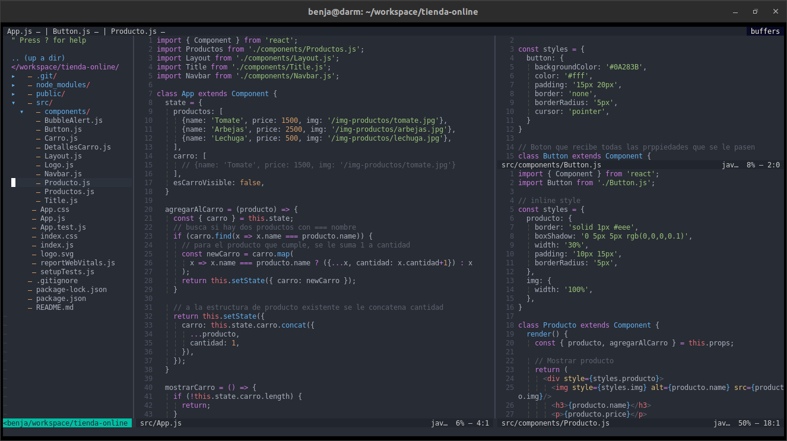

# Neovim Configuración
Este repositorio contiene una configuración para neovim, un editor de texto por terminal.

No todo el codigo esta comentado, debido a que mucho es copia y pega de otros repositorios.

Lista de Plugins
---------------- 
+ [ autor-pairs ](https://github.com/jiangmiao/auto-pairs)
+ [ vim-polyglot ](https://github.com/sheerun/vim-polyglot)
+ [ indentLine ](https://github.com/Yggdroot/indentLine)
+ [ onedark.vim ](https://github.com/joshdick/onedark.vim)
+ [ nerdtree ](https://github.com/preservim/nerdtree)
+ [ vim-devicons ](https://github.com/ryanoasis/vim-devicons)
+ [ vim-tmux-navigator ](https://github.com/christoomey/vim-tmux-navigator)
+ [ vim-easymotion ](https://github.com/easymotion/vim-easymotion)
+ [ vim-javascript ](https://github.com/pangloss/vim-javascript)
+ [ vim-gitgutter ](https://github.com/airblade/vim-gitgutter)
+ [ nerdtree-git-plugin ](https://github.com/Xuyuanp/nerdtree-git-plugin)
+ [ vim-airline ](https://github.com/vim-airline/vim-airline)
+ [ vim-airline-themes ](https://github.com/vim-airline/vim-airline-themes)
+ [ nerdcommenter ](https://github.com/preservim/nerdcommenter)
+ [ vim-visual-multi ](https://github.com/mg979/vim-visual-multi)
+ [ fzf ](https://github.com/junegunn/fzf)
+ [ golden_size ](https://github.com/dm1try/golden_size)
+ [ coc ](https://github.com/neoclide/coc.nvim)

Lenguajes server de COC 
-----------------------
+ [ coc-tsserver ](https://github.com/neoclide/coc-tsserver)
+ [ coc-json ](https://github.com/neoclide/coc-json)
+ [ coc-html ](https://github.com/neoclide/coc-html)

